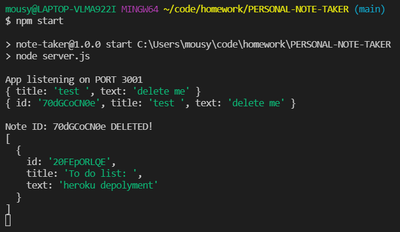
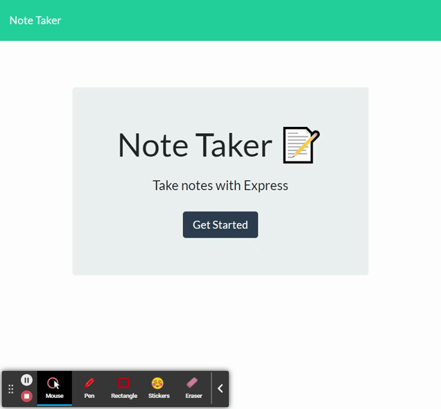

# PERSONAL-NOTE-TAKER 
  
  [](https://opensource.org/licenses/MIT)

--- 
--- 

<br>

## DESCRIPTION: 
I was tasked to create the backend for a note taking program, I was given the following requirements

```
GIVEN a note-taking application
WHEN I open the Note Taker
THEN I am presented with a landing page with a link to a notes page
WHEN I click on the link to the notes page
THEN I am presented with a page with existing notes listed in the left-hand column, plus empty fields to enter a new note title and the notes text in the right-hand column
WHEN I enter a new note title and the notes text
THEN a Save icon appears in the navigation at the top of the page
WHEN I click on the Save icon
THEN the new note I have entered is saved and appears in the left-hand column with the other existing notes
WHEN I click on an existing note in the list in the left-hand column
THEN that note appears in the right-hand column
WHEN I click on the Write icon in the navigation at the top of the page
THEN I am presented with empty fields to enter a new note title and the notes text in the right-hand column
```

Deployed with Heroku : https://mighty-citadel-94775.herokuapp.com/


---

<br>

## CONTENTS:
* [Usage](#USAGE:)
* [Contribution guidelines](#CONTRIBUTION-GUIDELINES:)
* [Tests/Demo](#TESTS:)
* [Questions](#QUESTIONS:)

---

<br>

## USAGE: 


This application requires an npm install and uses express.


---

<br>

## CONTRIBUTION GUIDELINES:


 


---

<br>

## TESTS:

I havnt run any tests in a test enviroment, but I have run tests through my browser. <s>I found it all works as intended, although the delete function dosnt fully run until the server is restarted. </s>



<s> My server terminal says the object is deleted, but the note remains until I restart the server completely.</s>

## DEMO:



---

<br>

## QUESTIONS: 
If you have questions, head to my [GitHub](https://github.com/Twistedmouse) 
or send an email at mousy93@hotmail.com


---

<br>

## FUTURE PLANS:

I plan to look into the delete function issues and find a fix. <br>
<b>SOLVED.</b>


---
---

https://opensource.org/licenses/MIT License
Copyright (c) 2021 Tristan Fontanini
[](https://opensource.org/licenses/MIT)


---

